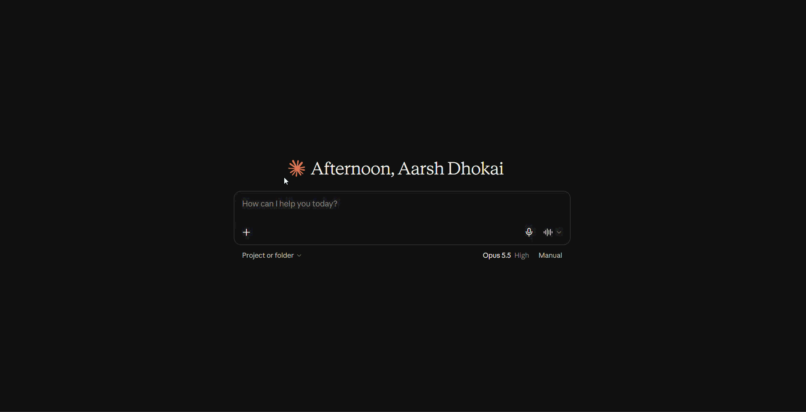
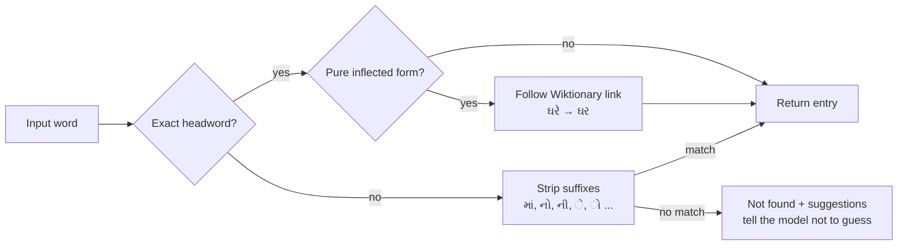

<!-- mcp-name: io.github.aarshbharat/gujarati-lexicon-mcp -->
# Gujarati Lexicon MCP Server   [](https://pypi.org/project/gujarati-lexicon-mcp/)

**A grounded Gujarati dictionary for AI assistants.** Connect it to Claude (or any MCP client) and the assistant looks Gujarati words up in real dictionary data instead of guessing: meanings, synonyms, idioms (રૂઢિપ્રયોગ), and inflected forms like ઘરમાં or આંખોમાં.

> **Why this exists:** LLMs are unreliable with Gujarati. They invent meanings, mix up idioms, and produce convincing but wrong usage. This server gives the model facts to stand on and tells it plainly when a word is *not* in the dictionary.

<!-- TODO: add demo GIF here -->


## Example

> **User:** અમે નો અર્થ શું છે?
>
> **Claude** (after calling `define`): અમે means "we", the plural of હું (I)…

> **User:** ઘરમાં નો અર્થ?
>
> **Claude:** ઘરમાં = ઘર + માં → "in the house". The server matched the inflected form to its base word ઘર.

## Features

| Primitive | Name | What it does |
|---|---|---|
| Tool | `define(word)` | Meanings, part of speech, examples, transliteration |
| Tool | `synonyms(word)` | Synonyms (સમાનાર્થી શબ્દો) from all sources, deduplicated |
| Tool | `idioms(word)` | Idioms (રૂઢિપ્રયોગ) containing the word; never invents any |
| Resource | `lexicon://word-of-the-day` | A daily word from the hand-checked set |
| Prompt | `explain_passage` | Explains a Gujarati passage word by word using the tools |

- **About 6,800 words** with English meanings, from Wiktionary
- **Hand-checked entries** with Gujarati meanings and idioms (curated set, growing)
- **Inflection handling:** ઘરમાં, ઘરે, આંખોમાં, and અમે resolve to their base words
- **"Did you mean?"** suggestions for typos (પાણિ → પાણી)
- **Source attribution** in every response, so the assistant can say where a meaning came from

## Quick start

Requires [uv](https://docs.astral.sh/uv/).

Add this to your Claude Desktop config (Settings → Developer → Edit Config):

```json
      "args": ["gujarati-lexicon-mcp"]
```

Restart Claude Desktop completely (quit from the system tray), open a new chat, and ask about any Gujarati word.

> On Windows, if Claude Desktop can't find `uvx`, use its full path (find it with `where uvx`), e.g. `C:\\Users\\<you>\\.local\\bin\\uvx.exe`.

## How lookup works

A word goes through three layers, from most to least reliable:



1. **Exact match.** A real dictionary entry always wins over a guessed base form.
2. **Wiktionary inflection links.** Wiktionary records that ઘરે is the locative of ઘર. The converter reads the structured `form_of` field, and falls back to parsing glosses like "plural of X" where that field is missing.
3. **Suffix stripping.** As a last resort, common endings are removed (up to two, e.g. આંખોમાં → આંખો → આંખ). A stripped form is accepted **only if it is a real headword**, so words are never mangled.

Responses keep sources separate (`curated` vs `wiktionary_senses`), so the model can attribute meanings honestly.

## Data sources

| Source | Provides | License |
|---|---|---|
| `curated.json` | Gujarati meanings, idioms, synonyms (hand-checked) | MIT (this project) |
| `wiktionary.json` | ~6,800 words: English meanings, transliterations, synonyms, inflection links | [CC BY-SA](https://en.wiktionary.org/wiki/Wiktionary:Copyrights) |

Wiktionary data comes from [Wiktionary](https://en.wiktionary.org) via [kaikki.org](https://kaikki.org/dictionary/Gujarati/index.html), extracted with [wiktextract](https://github.com/tatuylonen/wiktextract):

> Tatu Ylonen. *Wiktextract: Wiktionary as Machine-Readable Structured Data.* Proceedings of the 13th Conference on Language Resources and Evaluation (LREC), pp. 1317–1325, 2022.

### Rebuilding the Wiktionary data

The raw dump is not committed. To regenerate `wiktionary.json`:

```bash
mkdir -p data/raw
curl -L -o data/raw/kaikki-gujarati.jsonl "https://kaikki.org/dictionary/Gujarati/kaikki.org-dictionary-Gujarati.jsonl"
uv run python scripts/build_wiktionary.py
```

The converter groups entries by word, keeps only what the tools need (20 MB → a compact JSON file), drops non-Gujarati-script headwords, and records inflection links.

## Development

```bash
git clone https://github.com/aarshbharat/gujarati-lexicon-mcp
cd gujarati-lexicon-mcp
uv sync
uv run pytest -v                                    # run tests
uv run mcp dev src/gujarati_lexicon_mcp/server.py   # open MCP Inspector
```

Project layout:

```
src/gujarati_lexicon_mcp/
├── server.py           # MCP server: tools, resource, prompt
└── data/               # dictionary data shipped with the package
scripts/build_wiktionary.py   # raw kaikki dump → wiktionary.json
tests/                        # pytest
```


## Known limitations

- **Verb forms** are only partly covered: forms Wiktionary links (e.g. હોઈશ → હોવું) work, but phrases like લે છે are not lemmatized.
- **Wiktionary synonyms are merged across senses.** ઘર's list includes ઓફિસ (from its "office" sense). The tool tells the model this.
- **The curated set is small.** Most entries have English meanings only; Gujarati-language meanings and idioms come from the hand-checked data.
- **Grounding covers facts, not everything the model says.** The model may add correct background from its own knowledge (e.g. the inclusive/exclusive "we" distinction for અમે/આપણે). The server's instructions ask it to label general knowledge, but cannot force it.

[](https://pypi.org/project/gujarati-lexicon-mcp/)

## Roadmap

- [ ] Grow the curated set, especially idioms and proverbs (કહેવત)
- [ ] Sense-level synonyms instead of a merged list
- [ ] Better verb lemmatization
- [ ] Streamable HTTP transport and a hosted endpoint
- [ ] Publish to PyPI and the MCP Registry

## License

- **Code:** [MIT](LICENSE)
- **Wiktionary-derived data** (`src/gujarati_lexicon_mcp/data/wiktionary.json`): CC BY-SA, see [Wiktionary:Copyrights](https://en.wiktionary.org/wiki/Wiktionary:Copyrights)

---

Built by [Aarsh Dhokai](https://github.com/aarshbharat) · *AI × AI: Artificial Intelligence × Aarsh India*
